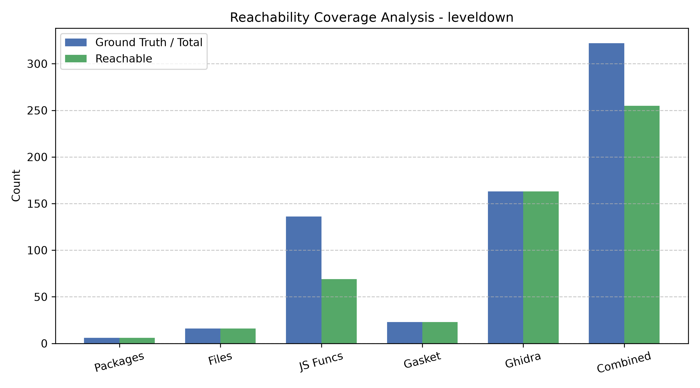
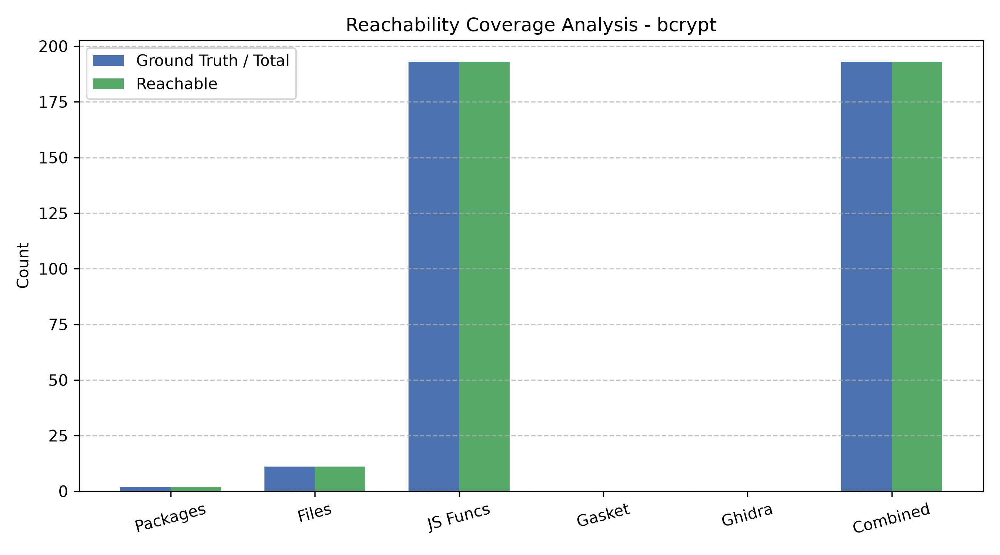
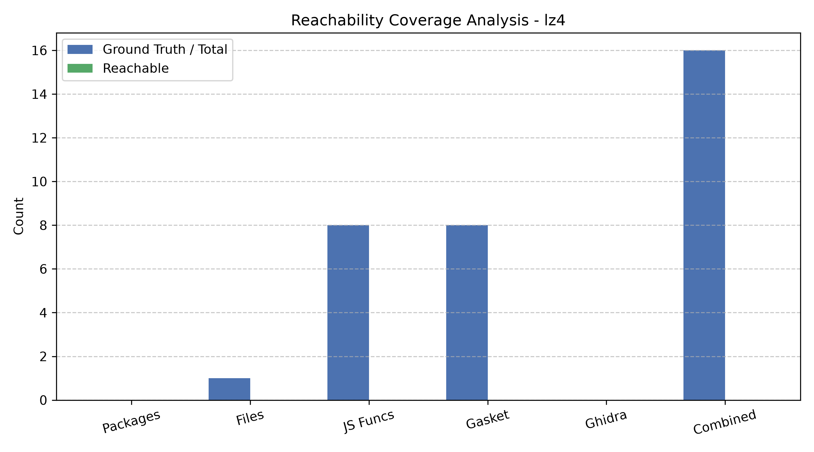
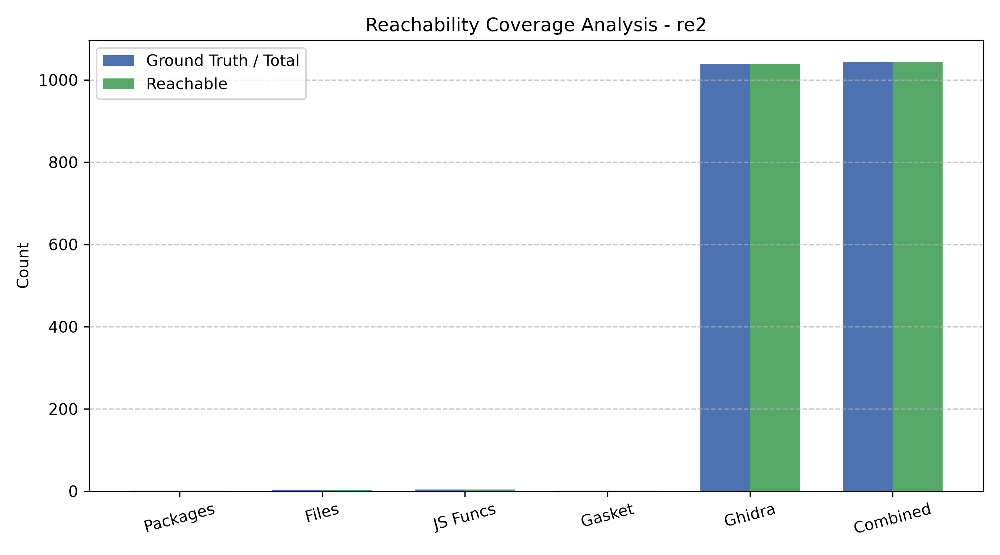
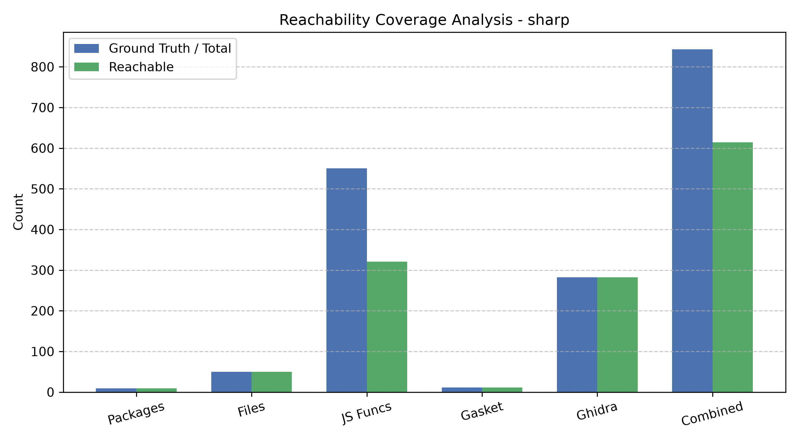
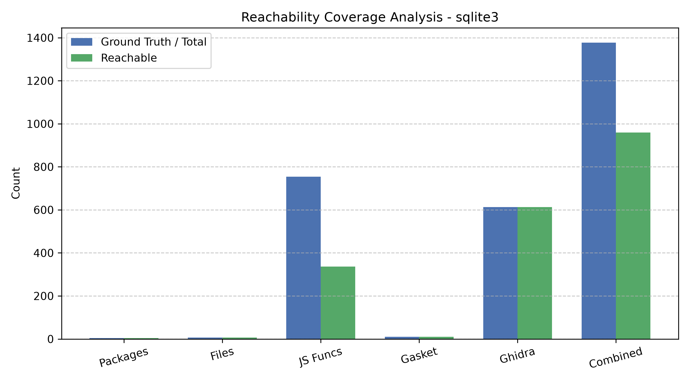
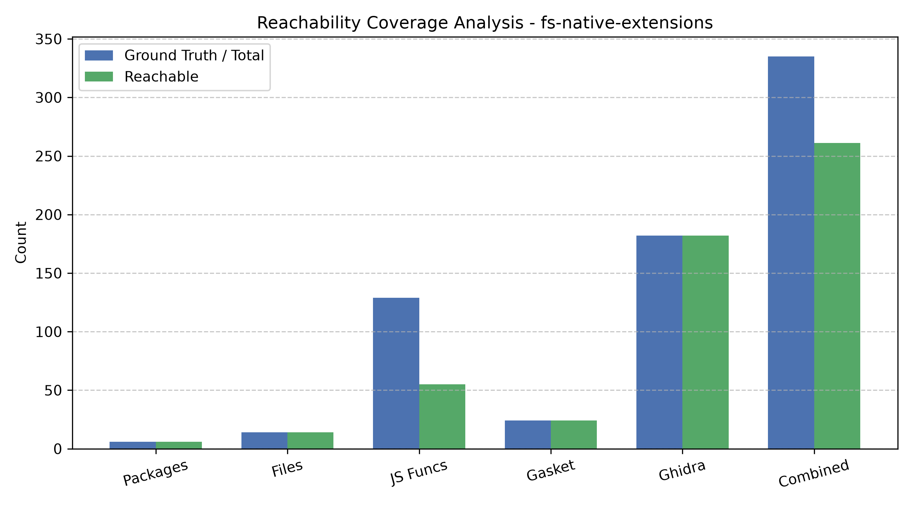
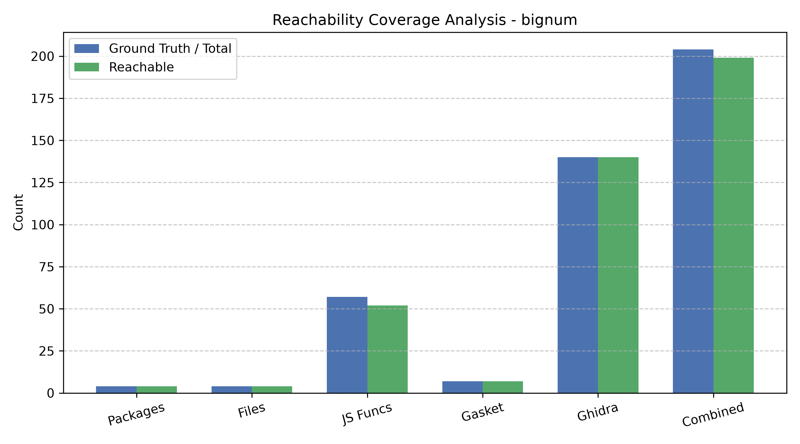

# Overall Reachability & Bloat Analysis Report

## 1. Global Statistical Summary

| Domain        | Granularity           | 5%     | Mean   | Median   | 95%     |
|:--------------|:----------------------|:-------|:-------|:---------|:--------|
| JavaScript    | Package (%)           | 35.00% | 87.50% | 100.00%  | 100.00% |
| JavaScript    | File (%)              | 35.00% | 87.50% | 100.00%  | 100.00% |
| JavaScript    | Function (%)          | 14.92% | 60.94% | 54.55%   | 100.00% |
| Binary/Native | Gasket Function (%)   | 0.00%  | 75.00% | 100.00%  | 100.00% |
| Binary/Native | Ghidra Function (%)   | 0.00%  | 75.00% | 100.00%  | 100.00% |
| Binary/Native | Native Total (%)      | 0.00%  | 75.00% | 100.00%  | 100.00% |
| Total         | Combined Function (%) | 24.37% | 74.64% | 78.55%   | 100.00% |

---

## 2. Individual Package Reports

### Package: `leveldown`

| Category                |   Total |   Reachable | Coverage (%)   |
|:------------------------|--------:|------------:|:---------------|
| Packages (Dependencies) |       6 |           6 | 100.00%        |
| Files (node_modules)    |      16 |          16 | 100.00%        |
| JS Functions (Regex)    |     136 |          69 | 50.74%         |
| Native Gasket Code      |      23 |          23 | 100.00%        |
| Native Ghidra Code      |     163 |         163 | 100.00%        |
| Combined Total Funcs    |     322 |         255 | 79.19%         |

---

### Package: `bcrypt`

| Category                |   Total |   Reachable | Coverage (%)   |
|:------------------------|--------:|------------:|:---------------|
| Packages (Dependencies) |       2 |           2 | 100.00%        |
| Files (node_modules)    |      11 |          11 | 100.00%        |
| JS Functions (Regex)    |     193 |         193 | 100.00%        |
| Native Gasket Code      |       0 |           0 | 0.00%          |
| Native Ghidra Code      |       0 |           0 | 0.00%          |
| Combined Total Funcs    |     193 |         193 | 100.00%        |

---

### Package: `lz4`

| Category                |   Total |   Reachable | Coverage (%)   |
|:------------------------|--------:|------------:|:---------------|
| Packages (Dependencies) |       0 |           0 | 0.00%          |
| Files (node_modules)    |       1 |           0 | 0.00%          |
| JS Functions (Regex)    |       8 |           0 | 0.00%          |
| Native Gasket Code      |       8 |           0 | 0.00%          |
| Native Ghidra Code      |       0 |           0 | 0.00%          |
| Combined Total Funcs    |      16 |           0 | 0.00%          |

---

### Package: `re2`

| Category                |   Total |   Reachable | Coverage (%)   |
|:------------------------|--------:|------------:|:---------------|
| Packages (Dependencies) |       1 |           1 | 100.00%        |
| Files (node_modules)    |       2 |           2 | 100.00%        |
| JS Functions (Regex)    |       4 |           4 | 100.00%        |
| Native Gasket Code      |       1 |           1 | 100.00%        |
| Native Ghidra Code      |    1039 |        1039 | 100.00%        |
| Combined Total Funcs    |    1044 |        1044 | 100.00%        |

---

### Package: `sharp`

| Category                |   Total |   Reachable | Coverage (%)   |
|:------------------------|--------:|------------:|:---------------|
| Packages (Dependencies) |       9 |           9 | 100.00%        |
| Files (node_modules)    |      50 |          50 | 100.00%        |
| JS Functions (Regex)    |     550 |         321 | 58.36%         |
| Native Gasket Code      |      11 |          11 | 100.00%        |
| Native Ghidra Code      |     282 |         282 | 100.00%        |
| Combined Total Funcs    |     843 |         614 | 72.84%         |

---

### Package: `sqlite3`

| Category                |   Total |   Reachable | Coverage (%)   |
|:------------------------|--------:|------------:|:---------------|
| Packages (Dependencies) |       4 |           4 | 100.00%        |
| Files (node_modules)    |       7 |           7 | 100.00%        |
| JS Functions (Regex)    |     754 |         336 | 44.56%         |
| Native Gasket Code      |      10 |          10 | 100.00%        |
| Native Ghidra Code      |     613 |         613 | 100.00%        |
| Combined Total Funcs    |    1377 |         959 | 69.64%         |

---

### Package: `fs-native-extensions`

| Category                |   Total |   Reachable | Coverage (%)   |
|:------------------------|--------:|------------:|:---------------|
| Packages (Dependencies) |       6 |           6 | 100.00%        |
| Files (node_modules)    |      14 |          14 | 100.00%        |
| JS Functions (Regex)    |     129 |          55 | 42.64%         |
| Native Gasket Code      |      24 |          24 | 100.00%        |
| Native Ghidra Code      |     182 |         182 | 100.00%        |
| Combined Total Funcs    |     335 |         261 | 77.91%         |

---

### Package: `bignum`

| Category                |   Total |   Reachable | Coverage (%)   |
|:------------------------|--------:|------------:|:---------------|
| Packages (Dependencies) |       4 |           4 | 100.00%        |
| Files (node_modules)    |       4 |           4 | 100.00%        |
| JS Functions (Regex)    |      57 |          52 | 91.23%         |
| Native Gasket Code      |       7 |           7 | 100.00%        |
| Native Ghidra Code      |     140 |         140 | 100.00%        |
| Combined Total Funcs    |     204 |         199 | 97.55%         |

---

